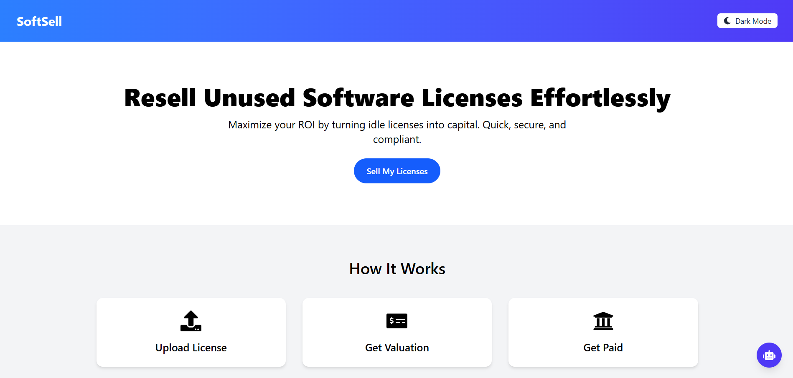
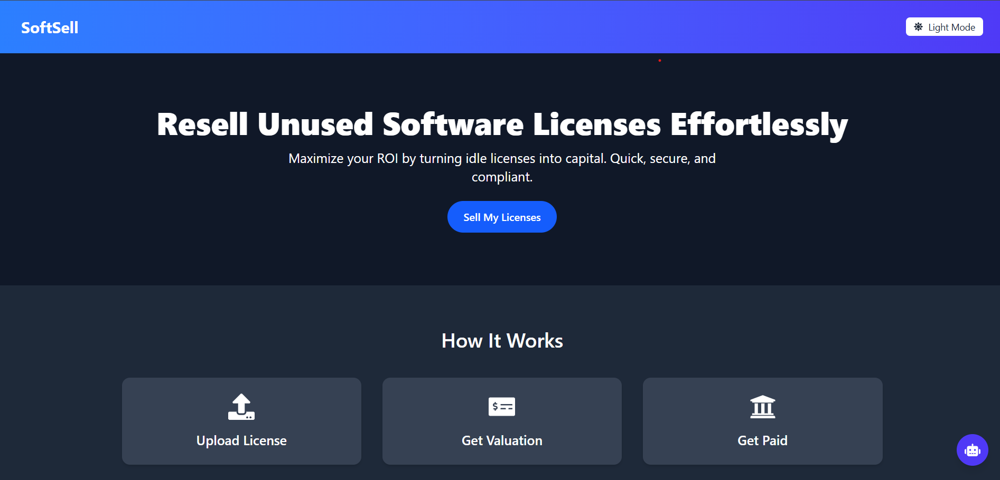

# 🛍️ SoftSell – Sell Unused Software Licenses

SoftSell is a responsive, modern single-page React application designed to help users sell unused software licenses securely and easily.

## 🔥 Features Implemented

- 🌞 Light/Dark Mode Toggle  
- 🖼️ Fully Redesigned Modern UI with Interactive Cards  
- 🧠 Intuitive Navigation Bar with Sticky Header  
- 💬 Contact Form with Input Validation  
- 🎨 Responsive Grid-based Layout for All Screen Sizes  
- 💡 Custom Color Palette & Iconography  
- 📱 Mobile-Friendly & Accessible Design  
- 🎯 Smooth Hover Animations and Section Transitions  

---

## 🎨 Design Choices

| Element        | Design Rationale |
|----------------|------------------|
| **Color Palette** | Soft Sky Blue & Teal accents with White/Dark Gray base to ensure readability and freshness |
| **Typography** | Inter (sans-serif), modern and clean with bold headings and lighter body text |
| **Layout** | Grid-based sectioning with strong visual hierarchy, spacing, and consistent margins |
| **Icons** | Used `react-icons` to enhance visual understanding and interactivity |
| **Form Styling** | Clean, rounded inputs with focus states and smooth shadows for depth |
| **Dark Mode** | Improves accessibility and reduces eye strain in low-light environments |

---

## ⏱️ Time Spent

I dedicated **4–5 hours** to:
- Designing a visually appealing UI from scratch
- Implementing a complete layout overhaul
- Adding meaningful interactions and accessibility
- Tuning responsiveness for desktop and mobile
- Writing clean, readable React code with Tailwind CSS

---

## 📸 Preview

  


---

## 🚀 Getting Started

```bash
git clone https://github.com/gop-c-k/softsell.git
cd softsell
npm install
npm start
